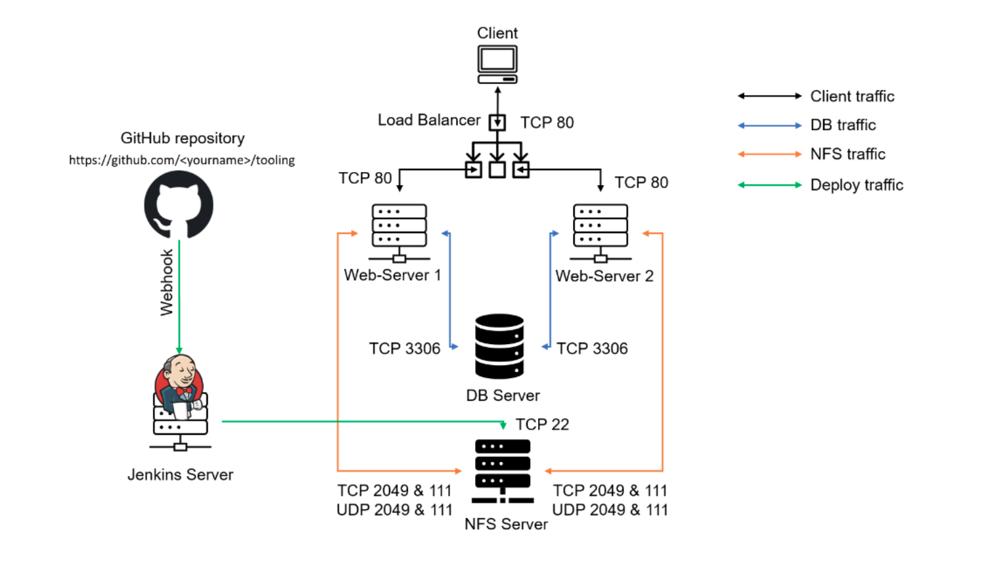

# 🚀 Tooling Web Application – CI/CD Automation with Jenkins

## 📌 Project Overview

This project demonstrates the **automation of a Tooling Web Application deployment using Jenkins Continuous Integration (CI), GitHub Webhooks, and a shared NFS Server.**

The primary goal is to eliminate manual deployment by creating a pipeline that automatically pulls changes from GitHub, builds the project, and deploys it to a shared storage location used by multiple web servers.


## 🧩 Architecture

**High-Level Flow**

- Developer pushes changes to GitHub (e.g. README update)
- GitHub sends a *Webhook* signal to Jenkins
- Jenkins:
  - Pulls the repository
  - Builds the project
  - Archives artifacts
- Deploys files to NFS server via SSH plugin
- Web servers access the updated files from NFS

## Architecture Diagram



## 🛠️ Technologies Used

| Tool / Technology | Purpose              |
| ----------------- | -------------------- |
| AWS EC2           | Hosting servers      |
| Ubuntu 20.04      | Jenkins server OS    |
| RHEL 9/10         | Web + NFS servers    |
| Jenkins           | CI/CD automation     |
| GitHub            | Source control       |
| Apache            | Web service          |
| PHP               | Application logic    |
| MySQL             | Database             |
| NFS               | Shared storage       |
| SSH               | Secure file transfer |


## 🔨 What I Implemented

✔ Created and configured a Jenkins Server

✔ Integrated GitHub with Jenkins via Webhooks

✔ Configured Jenkins to automatically build on code push

✔ Archived build artifacts

✔ Installed Publish over SSH plugin

✔ Deployed build artifacts to NFS Server (/mnt/apps)

✔ Allowed multiple web servers to load same content

✔ Verified live sync after every commit

## 🔁 Automation Workflow

Once configured, NO manual build is required.

The system works like this:
```
Edit README.md
↓
git commit -m "Update docs"
↓
git push
↓
Jenkins auto-builds & deploys
```

✅ Jenkins is triggered automatically

✅ Files are copied to NFS

✅ Web Servers instantly see new content

## ⚙️ Jenkins Configuration Summary

**Plugins Used**

- ✅ Git Plugin
- ✅ GitHub Integration
- ✅ Publish Over SSH

**Jenkins Job Settings**

- SCM: GitHub Repository
- Trigger: GitHub Webhook
- Post-build Action: Archive Artifacts
- Deployment Target: /mnt/apps on NFS Server

## 🧪 Validation Steps

To confirm automation is working:
```
cat /mnt/apps/README.md
```

You should see the latest content from GitHub — proving full automation.
