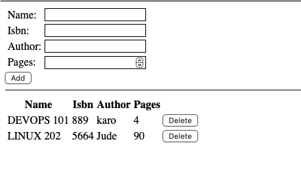

# 📚 Book Directory – MEAN Stack CRUD App

A full-stack **MEAN application** that allows users to manage a collection of books.

Built using **MongoDB, Express.js, AngularJS, and Node.js.**


## 🚀 Features

- 🔍 View all books stored in the MongoDB database
- ➕ Add new books (title, author, ISBN, and page count)
- ❌ Delete books by ISBN
- 🧩 Built with modular folder structure (apps, models, routes, public)
- 🌐 Serves a front-end AngularJS SPA through Express
- 🧠 Uses Mongoose ODM for MongoDB interaction


## 🧱 Project Structure

Books/
│
├── apps/
│   ├── models/
│   │   └── book.js          # Mongoose schema & DB connection
│   └── routes.js            # Express route handlers
│
├── public/                  # AngularJS front-end
│   ├── index.html
│   ├── scripts.js
│   └── styles.css
│
├── server.js                # Main Express server
├── package.json
└── README.md


## ⚙️ Technologies Used

|**Layer**|	|**Technology**|	|**Description**|
|---------| |--------------|    |---------------|
|Front-end|	|AngularJS, HTML, CSS, JavaScript|	|SPA for managing books|
|Back-end|	|Node.js, Express.js|	|RESTful API server|
|Database|	|MongoDB, Mongoose ODM|	|Data persistence|
|Tools|	|body-parser, path|	|Middleware and routing helpers|


## 🧩 How It Works

## 1️⃣ Backend (Express + MongoDB)
- Routes:
    - `GET /book` – Retrieve all books
    - `POST /book` – Add a new book
    - `DELETE /book/:isbn` – Remove a book by ISBN
- Uses Mongoose to connect to MongoDB (mongodb://localhost:27017/test)
- Serves AngularJS frontend with express.static()

## 2️⃣ Frontend (AngularJS)
- Displays the book list from the backend.
- Provides a simple form for adding and deleting books.
- Uses `$http` service to make REST API calls.

## 🧰 Installation & Setup

## Prerequisites
- Node.js (v18+)
- MongoDB running locally or remotely

# Step 1

## Install Node.js
`sudo apt update`

Upgrade ubuntu
`sudo apt upgrade`

Install NodeJS
`sudo apt install -y nodejs`

# Step 2
## Install MongoDB

**Install gnupg and curl if they are not already installed:**

`sudo apt-get install gnupg curl -y`

Before we add the repository, we need to add the GPG key with the command below:
`curl -fsSL https://www.mongodb.org/static/pgp/server-8.0.asc | \
sudo gpg -o /usr/share/keyrings/mongodb-server-8.0.gpg --dearmor`

**Then, add the MongoDB repository:**

`echo "deb [ arch=amd64,arm64 signed-by=/usr/share/keyrings/mongodb-server-8.0.gpg ] \
https://repo.mongodb.org/apt/ubuntu $(lsb_release -cs)/mongodb-org/8.0 multiverse" | \
sudo tee /etc/apt/sources.list.d/mongodb-org-8.0.list`

check file if its added

`cat /etc/apt/sources.list.d/mongodb-org-8.0.list`

# Update your package list

`sudo apt-get update`
`sudo apt-get install -y mongodb-org`

Now, we are ready to start installing the latest version of MongoDB simply by executing the following command on the server.

`sudo apt-get install -y mongodb-org`

After installation, check that the service file now exists:

`ls /lib/systemd/system/mongod.service`

If it’s there, proceed to start MongoDB step by step:

`sudo systemctl start mongod`
`sudo systemctl enable mongod`
`sudo systemctl status mongod`

You should see something like:
```
Active: active (running) with green color
```
• Install npm (Node package Manager) 

`sudo apt install -y npm`

• Install body-parser package which helps to process JSON files passed in requests to the server 

`sudo npm install body-parser`

Create a Folder named ‘Books’

- Create a folder named 'Books' and cd into the directory

`mkdir Books && cd Books`

- In the Books directory, initialize npm and add description: A simple book register app, run ls to see
- we need an `entry point` to be `server.js` when you run npm init
Run `npm init` this will create a package.json file (`ls` to see it )and after create a file named server.js

- NOTE if entry point in not included when you run npm init, you can edit your package.json to start `server.js` not index.js

`vi server.js` edit the file and copy and paste the below
```
var express = require('express');
var bodyParser = require('body-parser');
var path = require('path');
var app = express();
app.use(express.static(path.join(__dirname, 'public')));
app.use(bodyParser.json());
require('./apps/routes')(app);

// Catch-all route for Angular SPA - must be last
app.use(function(req, res) {
  res.sendFile(path.join(__dirname, 'public', 'index.html'));
});

app.set('port', 3300);
app.listen(app.get('port'), function() {
  console.log('Server up: http://localhost:' + app.get('port'));
});
```

# Step 3

## Install Express and set up routes to the server 

• Install Express 

`sudo npm install express`

We also will use `Mongoose` package which provides a straight-forward, schema-based solution to model your application data. We will use Mongoose to establish a schema for the database to store data of our book register.

`sudo npm install mongoose`

In the Books folder create a folder name 'apps' and cd into it 

`mkdir apps && cd apps`

create file names `routes.js` and edit with below code

```
const Book = require('./models/book');
const path = require('path');

module.exports = function (app) {
  // GET all books
  app.get('/book', async (req, res) => {
    try {
      const result = await Book.find({});
      res.json(result);
    } catch (err) {
      console.error(err);
      res.status(500).json({ error: 'Failed to fetch books' });
    }
  });

  // POST a new book
  app.post('/book', async (req, res) => {
    try {
      const book = new Book({
        name: req.body.name,
        isbn: req.body.isbn,
        author: req.body.author,
        pages: req.body.pages
      });

      const result = await book.save();
      res.json({
        message: 'Successfully added book',
        book: result
      });
    } catch (err) {
      console.error(err);
      res.status(500).json({ error: 'Failed to add book' });
    }
  });

  // DELETE a book by ISBN
  app.delete('/book/:isbn', async (req, res) => {
    try {
      const result = await Book.findOneAndRemove({ isbn: req.params.isbn });
      if (!result) {
        return res.status(404).json({ message: 'Book not found' });
      }
      res.json({
        message: 'Successfully deleted the book',
        book: result
      });
    } catch (err) {
      console.error(err);
      res.status(500).json({ error: 'Failed to delete book' });
    }
  });
};
```
in the apps folder, create a folder named `models` and cd inside models create a file `book.js`

```
const mongoose = require('mongoose');

// MongoDB connection
const dbHost = 'mongodb://localhost:27017/test';
mongoose.connect(dbHost).catch(err => {
  console.error('MongoDB connection error:', err);
});

// Optional: enable Mongoose debug mode (shows DB queries in console)
mongoose.set('debug', true);

// Define Book schema
const bookSchema = new mongoose.Schema({
  name: String,
  isbn: { type: String, index: true },
  author: String,
  pages: Number
});

// Create and export Book model
module.exports = mongoose.model('Book', bookSchema);
```

# Step 4

## Access the routes with Angular JS 

From the Books directory Create a folder named 'public' and cd into it `mkdir public && cd public`

then create a file name `scripts.js` and edit it

```
var app = angular.module('myApp', []);
app.controller('myCtrl', function($scope, $http) {
  // Load books when page loads
  $http({
    method: 'GET',
    url: '/book'
  }).then(function successCallback(response) {
    $scope.books = response.data;
  }, function errorCallback(response) {
    console.log('Error: ' + response);
  });

  $scope.del_book = function(book) {
    $http({
      method: 'DELETE',
      url: '/book/' + book.isbn
    }).then(function successCallback(response) {
      console.log(response);
      // Reload books after delete
      $http({
        method: 'GET',
        url: '/book'
      }).then(function successCallback(response) {
        $scope.books = response.data;
      });
    }, function errorCallback(response) {
      console.log('Error: ' + response);
    });
  };

  $scope.add_book = function() {
    var body = {
      name: $scope.Name,
      isbn: $scope.Isbn,
      author: $scope.Author,
      pages: $scope.Pages
    };
    $http({
      method: 'POST',
      url: '/book',
      data: body,
      headers: { 'Content-Type': 'application/json' }
    }).then(function successCallback(response) {
      console.log(response);
      // Clear form
      $scope.Name = '';
      $scope.Isbn = '';
      $scope.Author = '';
      $scope.Pages = '';
      // Reload books after add
      $http({
        method: 'GET',
        url: '/book'
      }).then(function successCallback(response) {
        $scope.books = response.data;
      });
    }, function errorCallback(response) {
      console.log('Error: ' + response);
    });
  };
});
```
in public folder, create a file named `index.html` and edit

```
<!doctype html>
<html ng-app="myApp" ng-controller="myCtrl">
<head>
<script
src="https://ajax.googleapis.com/ajax/libs/angularjs/1.6.4/angular.min.js"></script>
<script src="scripts.js"></script>
</head>
<body>
<div>
<table>
<tr>
<td>Name:</td>
<td><input type="text" ng-model="Name"></td>
</tr>
<tr>
<td>Isbn:</td>
<td><input type="text" ng-model="Isbn"></td>
</tr>
<tr>
<td>Author:</td>
<td><input type="text" ng-model="Author"></td>
</tr>
<tr>
<td>Pages:</td>
<td><input type="number" ng-model="Pages"></td>
</tr>
</table>
<button ng-click="add_book()">Add</button>
</div>
<hr>
<div>
<table>
<tr>
<th>Name</th>
<th>Isbn</th>
<th>Author</th>
<th>Pages</th>
</tr>
<tr ng-repeat="book in books">
<td>{{book.name}}</td>
<td>{{book.isbn}}</td>
<td>{{book.author}}</td>
<td>{{book.pages}}</td>
<td><input type="button" value="Delete" data-ng-click="del_book(book)"></td>
</tr>
</table>
</div>
</body>
</html>
```

• Change the directory back to `Books`

• Start the server by running `node server.js` - you should see the below prompt which show the server is running and connected via port 3300

```
ubuntu@ip-172-31-22-30:~/Books$ node server.js
Server up: http://localhost:3300
Mongoose: books.createIndex({ isbn: 1 }, { background: true })
```
You can launch a separate terminal / Putty or SSH console to test what `curl` command returns locally.

```jsx
curl -s http://localhost:3300
```

the curl will show

• To confirm its working fine, we will see the screenshot below.

```
ubuntu@ip-172-31-22-30:~/Books$ curl -s http://localhost:3300
<!doctype html>
<html ng-app="myApp" ng-controller="myCtrl">
<head>
<script
src="https://ajax.googleapis.com/ajax/libs/angularjs/1.6.4/angular.min.js"></script>
<script src="scripts.js"></script>
</head>
<body>
<div>
<table>
<tr>
<td>Name:</td>
<td><input type="text" ng-model="Name"></td>
</tr>
<tr>
<td>Isbn:</td>
<td><input type="text" ng-model="Isbn"></td>
</tr>
<tr>
<td>Author:</td>
<td><input type="text" ng-model="Author"></td>
</tr>
<tr>
<td>Pages:</td>
<td><input type="number" ng-model="Pages"></td>
</tr>
</table>
<button ng-click="add_book()">Add</button>
</div>
<hr>
<div>
<table>
<tr>
<th>Name</th>
<th>Isbn</th>
<th>Author</th>
<th>Pages</th>
</tr>
<tr ng-repeat="book in books">
<td>{{book.name}}</td>
<td>{{book.isbn}}</td>
<td>{{book.author}}</td>
<td>{{book.pages}}</td>
<td><input type="button" value="Delete" data-ng-click="del_book(book)"></td>
</tr>
</table>
</div>
</body>
</html>
```
To connect and see the content on a the internet, we need to open TCP port 3300 on AWS Web Console for our EC2 Instance.

- Now we can access our Book Register web application from the internet with a browser using Public IP address or Public DNS name.
- This is the content of the Web Book Register Application using a browser with information entered. Check the screenshot


