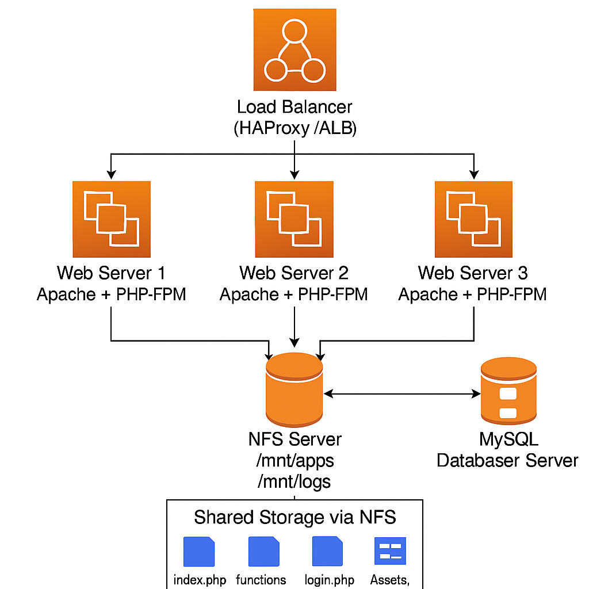

# 🚀 Multi-Server Tooling Web Application Deployment (NFS + MySQL + Apache + PHP on RHEL)

This project implements a **production-grade multi-tier architecture** featuring:

- 3 Web Servers (Apache + PHP-FPM)
- NFS Server for shared application storage and logs
- MySQL Database Server
- Load Balancer (optional enhancement)
- PHP "Tooling" application

This mirrors real enterprise Linux/DevOps infrastructure — covering networking, shared storage, service orchestration, and distributed application delivery

# 📘 Table of Contents

- Overview
- Architecture Diagram
- Technologies Used
- Components and Roles
- Installation Steps
    - NFS Server
    - Database Server
    - Web Servers
    - Application Deployment
- Validation
- Troubleshooting Guide
- Future Improvements

# 🧭 Overview

The purpose of this project is to deploy a PHP-based Tooling Web Application using a **shared NFS backend, a central MySQL database, and multiple Apache/PHP web servers.**

This configuration supports:

✔️ Shared application code

✔️ Centralized logs

✔️ Load-balanced traffic

✔️ Scalable, stateless web front-end

✔️ Central database

This setup is commonly used in production for **high availability, scalability, and maintainability.**

# 🖼️ Architecture Diagram




# 🛠️ Technologies Used

| Layer           | Technology                   |
| --------------- | ---------------------------- |
| OS              | RHEL 9 / RHEL 10             |
| Web Server      | Apache HTTPD                 |
| Backend         | PHP 8.x + PHP-FPM            |
| Database        | MySQL 8.x                    |
| Shared Storage  | NFS v4                       |
| Load Balancer   | (Optional) HAProxy / AWS ALB |
| Version Control | GitHub                       |

# 🏗️ Components and Roles

**🔹 NFS Server**
- Stores application code under `/mnt/apps`
- Hosts centralized logs under `/mnt/logs`
- Exported using NFSv4
- Web servers mount NFS for code + logs

**🔹 Database Server**
- MySQL 8
- Hosts `tooling` database and `users` table
- Provides authentication and app data

**🔹 Web Servers**
- RHEL instances running:
    - Apache (httpd)
    - PHP-FPM
    - NFS client
- All web servers mount the same application code

**🔹 Load Balancer (optional)**
- Provides high availability
- Distributes traffic across Web1/Web2/Web3

# 📦 Installation Steps
### 1️⃣ Configure NFS Server

```
sudo dnf install nfs-utils -y
sudo mkdir -p /mnt/apps /mnt/logs
```

Edit exports:
```
sudo vi /etc/exports
```

Add:
```
/mnt/apps *(rw,sync,no_root_squash)
/mnt/logs *(rw,sync,no_root_squash)
```

Export:
```
sudo systemctl enable --now nfs-server
sudo exportfs -arv
```

### 2️⃣ Configure MySQL Database Server

Install:
```
sudo dnf install @mysql -y
sudo systemctl enable --now mysqld
```

Set up DB:
```
CREATE DATABASE tooling;

CREATE USER 'webaccess'@'172.31.%' IDENTIFIED BY 'MyLatestPass456!';
GRANT ALL PRIVILEGES ON tooling.* TO 'webaccess'@'172.31.%';
FLUSH PRIVILEGES;
```

Import schema:
```
mysql -u webaccess -p tooling < tooling-db.sql
```

Create admin user:
```
INSERT INTO users (username, password, email, user_type, status)
VALUES ('myuser', MD5('MyLatestPass456!'), 'user@mail.com', 'admin', 1);
```

### 3️⃣ Configure Web Servers

Install packages:
```
sudo dnf install httpd php php-fpm php-mysqli php-mysqlnd nfs-utils -y
```

Enable:
```
sudo systemctl enable --now httpd php-fpm
```

Mount NFS:
```
sudo mkdir -p /var/www
sudo mount -t nfs 172.31.X.X:/mnt/apps /var/www
sudo mount -t nfs 172.31.X.X:/mnt/logs /var/log
```

Persist:
```
echo "172.31.X.X:/mnt/apps /var/www nfs defaults 0 0" | sudo tee -a /etc/fstab
echo "172.31.X.X:/mnt/logs /var/log nfs defaults 0 0" | sudo tee -a /etc/fstab
```

Fix Apache log folders:
```
sudo mkdir -p /var/log/httpd /var/log/php-fpm
sudo chown apache:apache /var/log/httpd
```

### 4️⃣ Deploy Tooling App

Clone to NFS:
```
cd /mnt/apps
git clone <repo_url> .
mkdir html && mv * html/
```

Web servers now see:
```
/var/www/html/index.php
```

### 5️⃣ Fix PHP App

**Update database connection***

Inside `/var/www/html/functions.php`:
```
$db = mysqli_connect('DB_PRIVATE_IP', 'webaccess', 
'password', 'tooling');
```

**Fix login form**

In `/var/www/html/login.php`:
```
<form method="post" action="index.php">
```

Remove HTML password limits:
```
<input type="password" name="password">
```

Restart:
```
sudo systemctl restart httpd php-fpm
```

# ✔️ Validation
**Test DB connectivity:**
```
mysql -h DB_IP -u webaccess -p
```

**Test Apache**:
```
curl http://localhost
```

**Browser**:
```
http://<webserver-ip>
```

Login using:
```
myuser
Password you created
```

# 🧯 Troubleshooting Guide

| Issue                     | Fix                                            |
| ------------------------- | ---------------------------------------------- |
| Login button does nothing | Remove password `pattern=".{4,8}"`             |
| HTTP 500 error            | DB credentials wrong in `functions.php`        |
| Apache won't start        | Create `/var/log/httpd` and `/var/log/php-fpm` |
| NFS mount missing         | `mount -a`                                     |
| "Access denied" MySQL     | Recreate user with `'172.31.%'`                |
| App loads but blank       | Ensure `/mnt/apps/html` structure exists       |


